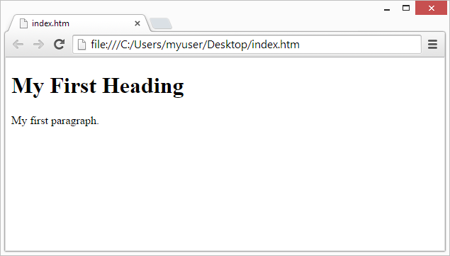

# HTML Introduction
---
### What is HTML?
 - HTML stands for Hyper Text Markup Language
 - HTML is the standard markup language for creating Web pages
- HTML describes the structure of a Web page
HTML consists of a series of elements
- HTML elements tell the browser how to display the content
- HTML elements label pieces of content such as "this is a heading", "this is a paragraph", "this is a link", etc.

### A Simple HTML Document
```html
<!DOCTYPE html>
<html>
<head>
<title>Page Title</title>
</head>
<body>

<h1>My First Heading</h1>
<p>My first paragraph.</p>

</body>
</html>

```
### Example Explained:

- The ```<!DOCTYPE html>``` declaration defines that this document is an HTML5 document

- The ```<html>``` element is the root element of an HTML page

- The ```<head>``` element contains meta information about the HTML page

- The``` <title>```element specifies a title for the HTML page (which is shown in the browser's title bar or in the page's tab)

- The ```<body>``` element defines the document's body, and is a container for all the visible contents, such as headings, paragraphs, images, hyperlinks, tables, lists, etc.

- The ```<h1>``` element defines a large heading

- The ```<p>``` element defines a paragraph


<br> <br> <br>

# What is an HTML Element?
An HTML element is defined by a start tag, some content, and an end tag:

Like This:
```
<tagname> Content goes here... </tagname>
```
The HTML element is everything from the start tag to the end tag:

```html
<h1>My First Heading</h1>
<p>My first paragraph.</p>

```
<br> <br> <br> 
# Web Browsers?
The purpose of a web browser (Chrome, Edge, Firefox, Safari) is to read HTML documents and display them correctly.

A browser does not display the HTML tags, but uses them to determine how to display the document:


<br> <br> <br> 
# HTML Page Structure

```html
<html>
<head>
<title>Page title</title>
</head>
<body>
<h1>This is a heading</h1>
<p>This is a paragraph.</p>
<p>This is another paragraph.</p>
</body>
</html>
```
<strong>Note:</strong> The content inside the ```<body>``` section will be displayed in a browser. The content inside the ```<title>``` element will be shown in the browser's title bar or in the page's tab.

# HTML History
<p>Since the early days of the World Wide Web, there have been many versions of HTML:</p>

<p>The first version of HTML was written by Tim Berners-Lee in 1993. Since then, there have been many different versions of HTML. The most widely used version throughout the 2000's was HTML 4.01, which became an official standard in December 1999.</p>

| Year  |     	    Version |
| ---   | ----------------- |
| 1989	| Tim Berners-Lee invented www  |
| 1991  |	Tim Berners-Lee invented HTML |
| 1993	| Dave Raggett drafted HTML+ | 
| 1995	| HTML Working Group defined HTML 2.0 | 
| 1997	| W3C Recommendation: HTML 3.2 | 
| 1999	| W3C Recommendation: HTML 4.01 | 
| 2000	| W3C Recommendation: XHTML 1.0 |
| 2008	| WHATWG HTML5 First Public Draft |
| 2012	| WHATWG HTML5 Living Standard | 
| 2014	| W3C Recommendation: HTML5 |
| 2016	| W3C Candidate Recommendation: HTML 5.1 |
| 2017	| W3C Recommendation: HTML5.1 2nd Edition |
| 2017	| W3C Recommendation: HTML5.2 | 

<br>  <br>  <br> 

# HTML vs XHTML: 
<p>HTML (HypertextMarkup Language) and XHTML (ExtensibleHypertext Markup Language) are both markup languages used for creating and displaying web pages. The main difference between them is the syntax and structure; HTML is more lenient in its syntax, while XHTML has a more strict syntax and follows XML rules.</p>

[Learn More from w3schools](https://www.w3schools.com/html/html_xhtml.asp)

