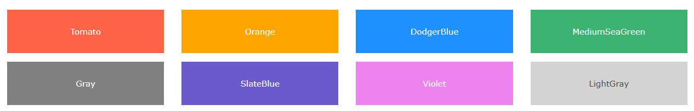

# HTML Colors
HTML colors are specified with predefined color names, or with RGB, HEX, HSL, RGBA, or HSLA values.

<br> 

# 1- Color Names

In HTML, a color can be specified by using a color name:
Like: 


HTML supports 140 standard color names. [Colors Name list](https://www.w3schools.com/colors/colors_names.asp)

<br> <br>

# # Background Color
You can set the background color for HTML elements:
```html
<!DOCTYPE html>
<html>
<body>

<h1 style="background-color:DodgerBlue;">Hello World</h1>

<p style="background-color:Tomato;">
Lorem ipsum dolor sit amet, consectetuer adipiscing elit, sed diam nonummy nibh euismod tincidunt ut laoreet dolore magna aliquam erat volutpat.
Ut wisi enim ad minim veniam, quis nostrud exerci tation ullamcorper suscipit lobortis nisl ut aliquip ex ea commodo consequat.
</p>

</body>
</html>
````

<br> 

# #  Text Color
You can set the color of text:

```html
<!DOCTYPE html>
<html>
<body>

<h3 style="color:Tomato;">Hello World</h3>

<p style="color:DodgerBlue;">Lorem ipsum dolor sit amet, consectetuer adipiscing elit, sed diam nonummy nibh euismod tincidunt ut laoreet dolore magna aliquam erat volutpat.</p>

<p style="color:MediumSeaGreen;">Ut wisi enim ad minim veniam, quis nostrud exerci tation ullamcorper suscipit lobortis nisl ut aliquip ex ea commodo consequat.</p>

</body>
</html>
```
<br> <br>

# # Border Color
You can set the color of borders:

``` html
<!DOCTYPE html>
<html>
<body>

<h1 style="border: 2px solid Tomato;">Hello World</h1>

<h1 style="border: 2px solid DodgerBlue;">Hello World</h1>

<h1 style="border: 2px solid Violet;">Hello World</h1>

</body>
</html>

```

# 2- Color Values

In HTML, colors can also be specified using RGB values, HEX values, HSL values, RGBA values, and HSLA values.

The following three <div> elements have their background color set with RGB, HEX, and HSL values:

```html
<!DOCTYPE html>
<html>
<body>

<p>Same as color name "Tomato":</p>

<h1 style="background-color:rgb(255, 99, 71);">rgb(255, 99, 71)</h1>
<h1 style="background-color:#ff6347;">#ff6347</h1>
<h1 style="background-color:hsl(9, 100%, 64%);">hsl(9, 100%, 64%)</h1>

<p>Same as color name "Tomato", but 50% transparent:</p>
<h1 style="background-color:rgba(255, 99, 71, 0.5);">rgba(255, 99, 71, 0.5)</h1>
<h1 style="background-color:hsla(9, 100%, 64%, 0.5);">hsla(9, 100%, 64%, 0.5)</h1>

<p>In addition to the predefined color names, colors can be specified using RGB, HEX, HSL, or even transparent colors using RGBA or HSLA color values.</p>

</body>
</html>
```
==============================================

# HTML RGB and RGBA Colors

An RGB color value represents RED, GREEN, and BLUE light sources.

An RGBA color value is an extension of RGB with an Alpha channel (opacity).
---
## RGB Color Values
In HTML, a color can be specified as an RGB value, using this formula:

## rgb(red, green, blue)

Each parameter (red, green, and blue) defines the intensity of the color with a value between 0 and 255.

This means that there are 256 x 256 x 256 = 16777216 possible colors!

For example, rgb(255, 0, 0) is displayed as red, because red is set to its highest value (255), and the other two (green and blue) are set to 0.

Another example, rgb(0, 255, 0) is displayed as green, because green is set to its highest value (255), and the other two (red and blue) are set to 0.

To display black, set all color parameters to 0, like this: rgb(0, 0, 0).

To display white, set all color parameters to 255, like this: rgb(255, 255, 255).

Experiment by mixing the RGB values below:

```html
<!DOCTYPE html>
<html>
<body>

<h1 style="background-color:rgb(255, 0, 0);">rgb(255, 0, 0)</h1>
<h1 style="background-color:rgb(0, 0, 255);">rgb(0, 0, 255)</h1>
<h1 style="background-color:rgb(60, 179, 113);">rgb(60, 179, 113)</h1>
<h1 style="background-color:rgb(238, 130, 238);">rgb(238, 130, 238)</h1>
<h1 style="background-color:rgb(255, 165, 0);">rgb(255, 165, 0)</h1>
<h1 style="background-color:rgb(106, 90, 205);">rgb(106, 90, 205)</h1>

</body>
</html>
```
### Learn More about RGB & RGBA [Click Here](https://www.w3schools.com/html/html_colors_rgb.asp)


---

<br> <br>

# HTML HEX Colors
A hexadecimal color is specified with: #RRGGBB, where the RR (red), GG (green) and BB (blue) hexadecimal integers specify the components of the color.
---

## HEX Color Values
In HTML, a color can be specified using a hexadecimal value in the form:

#rrggbb

Where rr (red), gg (green) and bb (blue) are hexadecimal values between 00 and ff (same as decimal 0-255).

For example, #ff0000 is displayed as red, because red is set to its highest value (ff), and the other two (green and blue) are set to 00.

Another example, #00ff00 is displayed as green, because green is set to its highest value (ff), and the other two (red and blue) are set to 00.

To display black, set all color parameters to 00, like this: #000000.

To display white, set all color parameters to ff, like this: #ffffff.

Experiment by mixing the HEX values below:

### Learn More about HEX Color [Click Here](https://www.w3schools.com/html/html_colors_hex.asp)

----

<br> <br>

# HTML HSL and HSLA Colors
HSL stands for hue, saturation, and lightness.

HSLA color values are an extension of HSL with an Alpha channel (opacity).
---

### HSL Color Values
In HTML, a color can be specified using hue, saturation, and lightness (HSL) in the form:

hsl(hue, saturation, lightness)

Hue is a degree on the color wheel from 0 to 360. 0 is red, 120 is green, and 240 is blue.

Saturation is a percentage value. 0% means a shade of gray, and 100% is the full color.

Lightness is also a percentage value. 0% is black, and 100% is white.

Experiment by mixing the HSL values below:


### HSLA Color Values
HSLA color values are an extension of HSL color values, with an Alpha channel - which specifies the opacity for a color.

An HSLA color value is specified with:

hsla(hue, saturation, lightness, alpha)

The alpha parameter is a number between 0.0 (fully transparent) and 1.0 (not transparent at all):

Experiment by mixing the HSLA values below:

### Learn More about HSL & HSLA Color [Click Here](https://www.w3schools.com/html/html_colors_hsl.asp)