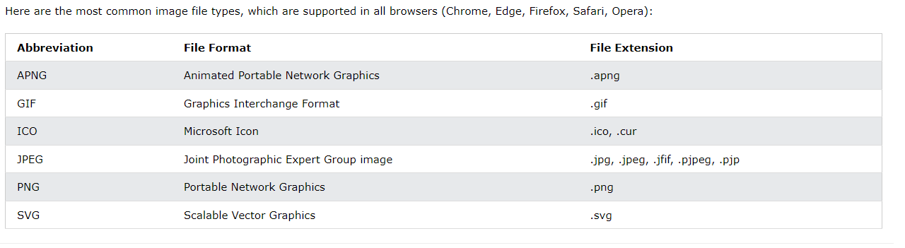

# HTML Images
Images can improve the design and the appearance of a web page.

```html
<!DOCTYPE html>
<html>
<body>

<h2>HTML Image</h2>


</body>
</html>

```

<br> <br> <br>

# HTML Images Syntax

The HTML `` tag is used to embed an image in a web page.
The `` tag has two required attributes:

- `src` - Specifies the path to the image
- `alt` - Specifies an alternate text for the image

## 1- The src Attribute
The required `src` attribute specifies the path (URL) to the image.

## 2- The alt Attribute
The required alt attribute provides an alternate text for an image, if the user for some reason cannot view it (because of slow connection, an error in the src attribute, or if the user uses a screen reader).


<br> <br> <br>
# Image Size - Width and Height

You can use the `style` attribute to specify the width and height of an image.

Exp-1:

```HTML


```

Exp-2:

```HTML


```

<br> <br> <br>
# Images in Another Folder
If you have your images in a sub-folder, you must include the folder name in the `src` attribute:

```html


```

<br> <br> <br>
# Images on Another Server/Website

Some web sites point to an image on another server.

To point to an image on another server, you must specify an absolute (full) URL in the `src` attribute:

```html


```
<br> <br> <br>
# Image as a Link
To use an image as a link, put the `` tag inside the` <a>` tag:

```html
<a href="default.asp">
  
</a>

```

<br> <br> <br>
# Common Image Formats




<br> <br> <br>
# Chapter Summary

- Use the HTML` ` element to define an image
- Use the HTML `src` attribute to define the URL of the image
- Use the HTML `alt` attribute to define an alternate text for an image, if it cannot be displayed
- Use the HTML `width` and `height` attributes or the CSS `width` and `height` properties to define the size of the image
- Use the CSS `float` property to let the image float to the left or to the right