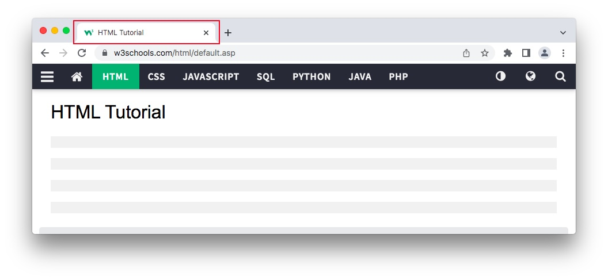

# HTML Page Title
Every web page should have a page title to describe the meaning of the page.

The `<title>` element adds a title to your page:



```html
<!DOCTYPE html>
<html>
<head>
  <title>HTML Tutorial</title>
</head>
<body>

The content of the document......

</body>
</html>
```


