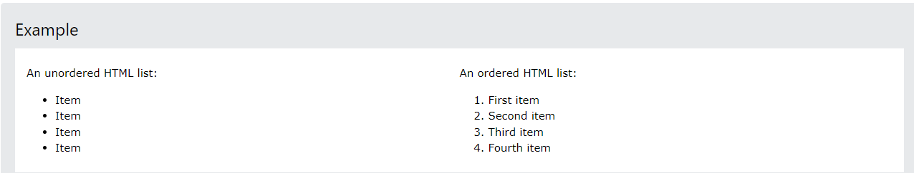
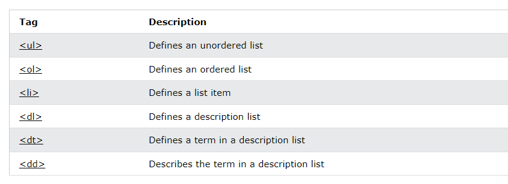

# HTML Lists
HTML lists allow web developers to group a set of related items in lists.


<br> <br>
## 1- Unordered HTML List
An unordered list starts with the `<ul>` tag. Each list item starts with the `<li>` tag.

The list items will be marked with bullets (small black circles) by default:

```html
<ul>
  <li>Coffee</li>
  <li>Tea</li>
  <li>Milk</li>
</ul>
```

<br> <br>

## 2- Ordered HTML List
An ordered list starts with the `<ol>` tag. Each list item starts with the `<li>` tag.

The list items will be marked with numbers by default:

```html
<ol>
  <li>Coffee</li>
  <li>Tea</li>
  <li>Milk</li>
</ol>
```

<br> <br>
## 3- HTML Description Lists
HTML also supports description lists.

A description list is a list of terms, with a description of each term.

The `<dl>` tag defines the description list, the `<dt>` tag defines the term (name), and the `<dd>` tag describes each term:

```html
<dl>
  <dt>Coffee</dt>
  <dd>- black hot drink</dd>
  <dt>Milk</dt>
  <dd>- white cold drink</dd>
</dl>

```

<br> <br>

# HTML List Tags
