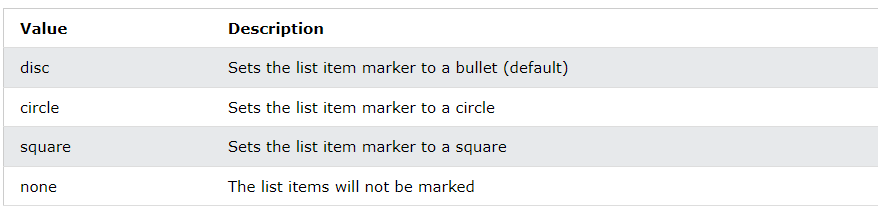
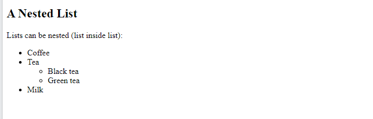
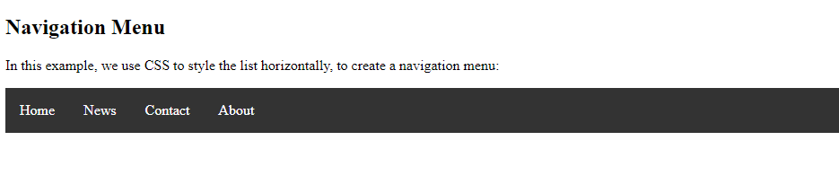

# HTML Unordered Lists
The HTML `<ul>` tag defines an unordered (bulleted) list.

## Unordered HTML List - Choose List Item Marker
The CSS ``list-style-type` property is used to define the style of the list item marker. It can have one of the following values:


### Example - Disc
```html
<ul style="list-style-type:disc;">
  <li>Coffee</li>
  <li>Tea</li>
  <li>Milk</li>
</ul>

```
<br>

### Example - Circle

```html
<ul style="list-style-type:circle;">
  <li>Coffee</li>
  <li>Tea</li>
  <li>Milk</li>
</ul>

```


<br>

### Example - Square

```html
<ul style="list-style-type:square;">
  <li>Coffee</li>
  <li>Tea</li>
  <li>Milk</li>
</ul>

```
<br>


### Example - none

```html
<ul style="list-style-type:square;">
  <li>Coffee</li>
  <li>Tea</li>
  <li>Milk</li>
</ul>

```

<br> <br>

# Nested HTML Lists

Lists can be nested (list inside list):

### Example




```httml

<!DOCTYPE html>
<html>
<body>

<h2>A Nested List</h2>
<p>Lists can be nested (list inside list):</p>

<ul>
  <li>Coffee</li>
  <li>Tea
    <ul>
      <li>Black tea</li>
      <li>Green tea</li>
    </ul>
  </li>
  <li>Milk</li>
</ul>

</body>
</html>

```

# Horizontal List with CSS

HTML lists can be styled in many different ways with CSS.

One popular way is to style a list horizontally, to create a navigation menu:



```html

<!DOCTYPE html>
<html>
<head>
<style>
ul {
  list-style-type: none;
  margin: 0;
  padding: 0;
  overflow: hidden;
  background-color: #333333;
}

li {
  float: left;
}

li a {
  display: block;
  color: white;
  text-align: center;
  padding: 16px;
  text-decoration: none;
}

li a:hover {
  background-color: #111111;
}
</style>
</head>
<body>

<h2>Navigation Menu</h2>
<p>In this example, we use CSS to style the list horizontally, to create a navigation menu:</p>

<ul>
  <li><a href="#home">Home</a></li>
  <li><a href="#news">News</a></li>
  <li><a href="#contact">Contact</a></li>
  <li><a href="#about">About</a></li>
</ul>

</body>
</html>

```


