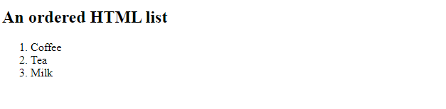
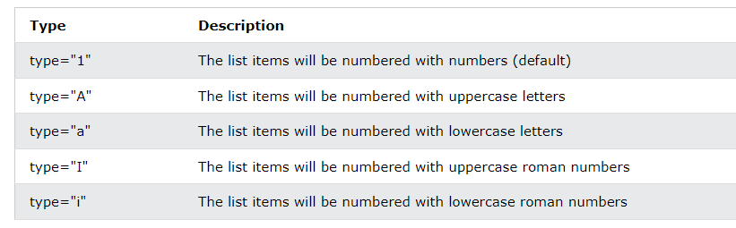
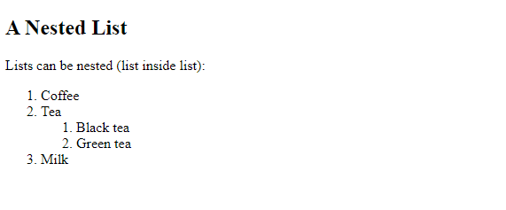
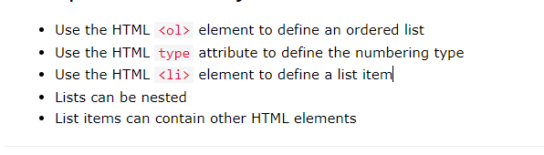

# HTML Ordered Lists

An ordered list starts with the `<ol>` tag. Each list item starts with the `<li>` tag.

The list items will be marked with numbers by default:

## Example:


```html
<!DOCTYPE html>
<html>
<body>

<h2>An ordered HTML list</h2>

<ol>
  <li>Coffee</li>
  <li>Tea</li>
  <li>Milk</li>
</ol>  

</body>
</html>
```

# Ordered HTML List - The Type Attribute

The `type` attribute of the `<ol>` tag, defines the type of the list item marker:


### Numbers:
```html
<ol type="1">
  <li>Coffee</li>
  <li>Tea</li>
  <li>Milk</li>
</ol>
```

<br>

### Uppercase Letters:

```html
<ol type="A">
  <li>Coffee</li>
  <li>Tea</li>
  <li>Milk</li>
</ol>
```

<br>

### Lowercase Letters:

```html
<ol type="I">
  <li>Coffee</li>
  <li>Tea</li>
  <li>Milk</li>
</ol>
```

<br>

### Uppercase Roman Numbers:

```html
<ol type="I">
  <li>Coffee</li>
  <li>Tea</li>
  <li>Milk</li>
</ol>
```

### Lowercase Roman Numbers:

```html
<ol type="i">
  <li>Coffee</li>
  <li>Tea</li>
  <li>Milk</li>
</ol>
```

<br>

### Control List Counting

By default, an ordered list will start counting from 1. If you want to start counting from a specified number, you can use the start attribute:

```html
<!DOCTYPE html>
<html>
<body>

<h2>The start attribute</h2>
<p>By default, an ordered list will start counting from 1. Use the start attribute to start counting from a specified number:</p>

<ol start="50">
  <li>Coffee</li>
  <li>Tea</li>
  <li>Milk</li>
</ol>

<ol type="I" start="50">
  <li>Coffee</li>
  <li>Tea</li>
  <li>Milk</li>
</ol>

</body>
</html>
```

<br>

### Nested HTML Lists

Lists can be nested (list inside list):



```html
<!DOCTYPE html>
<html>
<body>

<h2>A Nested List</h2>
<p>Lists can be nested (list inside list):</p>

<ol>
  <li>Coffee</li>
  <li>Tea
    <ol>
      <li>Black tea</li>
      <li>Green tea</li>
    </ol>
  </li>
  <li>Milk</li>
</ol>

</body>
</html>
```


<br>

# Chapter Summary



