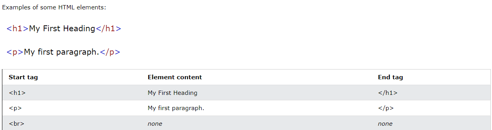

# HTML Elements:
An HTML element is defined by a start tag, some content, and an end tag.

### Examples of some HTML elements:


Note: Some HTML elements have no content (like the <br> element). These elements are called empty elements. Empty elements do not have an end tag!


# 1- Nested HTML Elements
HTML elements can be nested (this means that elements can contain other elements).

All HTML documents consist of nested HTML elements.

The following example contains four HTML elements ```(<html>, <body>, <h1> and <p>):```

Example:
``` html
<!DOCTYPE html>
<html>
<body>

<h1>My First Heading</h1>
<p>My first paragraph.</p>

</body>
</html>

```
<br>  <br> 

# 2- Empty HTML Elements

Empty or void elements are HTML elements that don’t require a closing tag because they contain no content. They are self-contained, independently complete, and don’t rely on other elements to function. Instead of having separate open and closing tags, empty elements combine both into a single tag, making it easy to add certain types of content to a page.

You can use empty HTML elements to add structure and functionality to web pages, such as embedding images, links, breaks, lists, or metadata.

For example, the break tag <b> does not have an end tag, whereas the paragraph tag <p> must end with the appropriate closing tag </p> to display the content correctly.

Here are a few common empty elements in HTML:


HTML elements with no content are called empty elements.

The ```<br>``` tag defines a line break, and is an empty element without a closing tag:

Example:
```html
<p>This is a <br> paragraph with a line break.</p>
 embeds an image into the document
<embed> inserts external multimedia content like audio and video into the document
<link> embeds a hyperlink from the current document to an external source
<meta> inserts metadata into the document's code, such as titles, tags, and descriptions.

```
[List of Empty HTML Elements]()


# HTML is Not Case Sensitive
HTML tags are not case sensitive: ```<P> means the same as <p>.```

The HTML standard does not require lowercase tags, but W3C recommends lowercase in HTML, and demands lowercase for stricter document types like XHTML.

At W3Schools we always use lowercase tag names.